# Born2beroot Tutorial in English

[Ver Tutorial em Português](born2beroot.tt.pt.md)

## 1. Download the `ISO` file
[](https://cdimage.debian.org/debian-cd/current/amd64/iso-cd/debian-12.8.0-amd64-netinst.iso)

## 2. Set Up the Virtual Machine
> ### 2.1
> Open VirtualBox and click `New`.

</br>

> ### 2.2
> Choose the name and folder.

> [!Warning]
> Make sure to store it in the `sgoinfre` folder located on the 42 server.
> <br/>This step is essential to avoid running out of space during the session, which could cause installation failures.
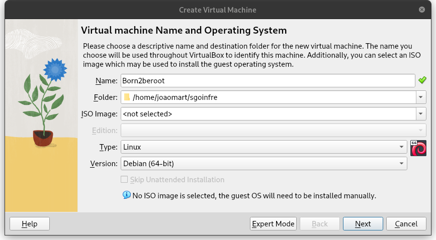
</br>

> ### 2.3
> Select the total `RAM` memory reserved for the machine (1024).
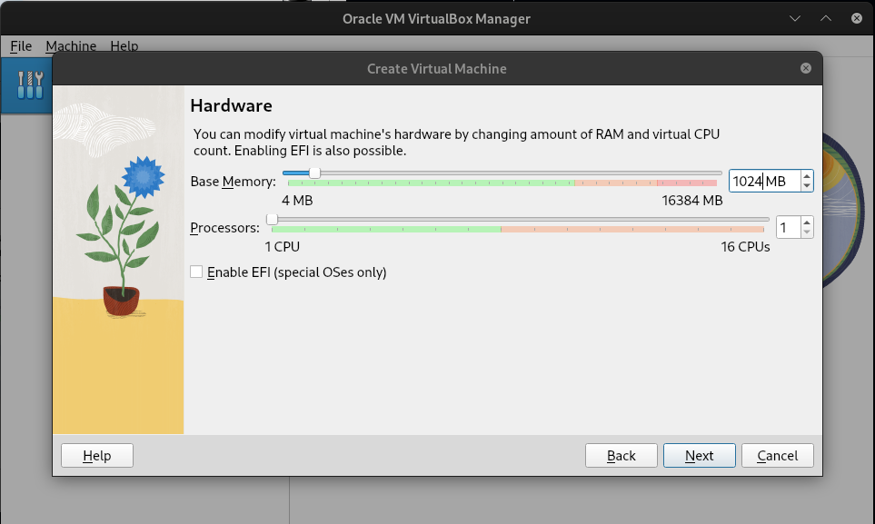
</br>

> ### 2.4
> Define the size of the hard disk `(8Gb)`.

</br>

> ### 2.5
> Then click `Finish`.
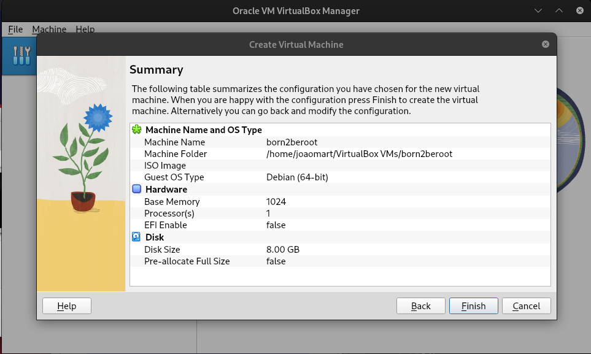
</br>

> ### 2.6
> Now, let's add the ISO file by clicking on `Settings`.

</br>

> ### 2.7
> `Storage` > `IDE Controller` > `Empty`.
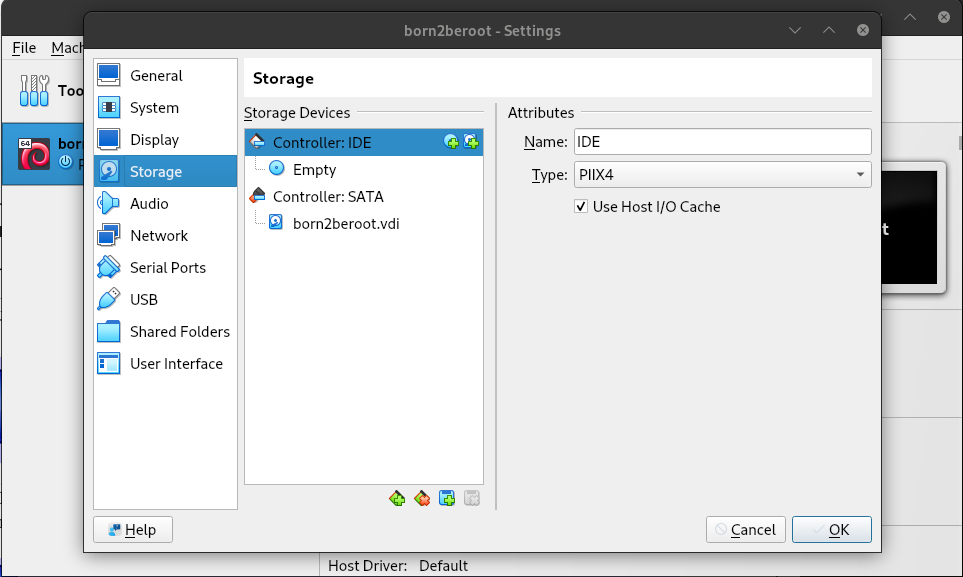
</br>

> ### 2.8
> Click the üíø icon under Optical Drive and select `Choose Disk File`.

</br>

> ### 2.9
> Select the downloaded `ISO` file and click `OK`.
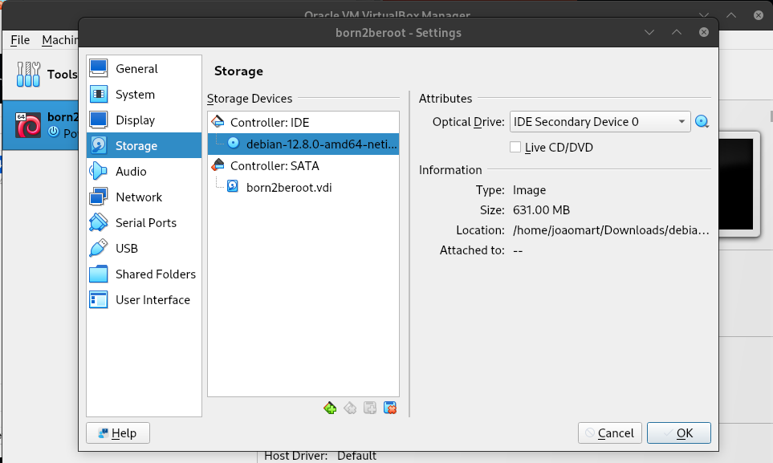
</br>

> ### 2.10
> Now, just click `Start` to begin the ISO installation on the virtual machine.
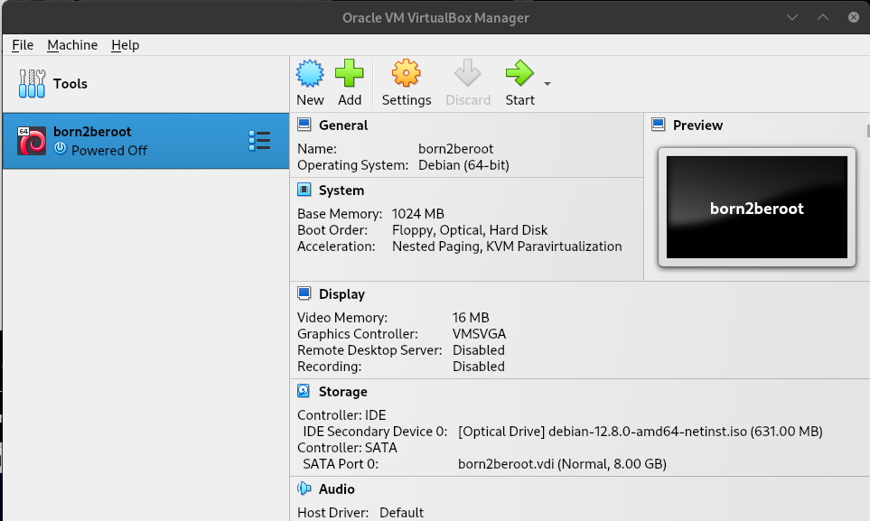
</br>

## 3. 🌀 Installing Debian
> [!Warning]
> Use the `Right Ctrl` key to capture or release the mouse in the virtual machine
> </br>Press **Enter** to confirm an action and use the **Arrow Keys** to navigate the options.

> ### 3.1 Installation Preparation
> Select Non-Graphical Version.
> </br>The Born2beroot project requires a command-line-only environment, so choose the non-graphical version.

</br>

> ### 3.2: Language and Location Selection

> ### 3.2.1
> Choose the installation language. The default is English.

</br>

> ### 3.2.2
> Choose your country. If not listed, use the `Other` option to find your continent.

</br>

> ### 3.2.3
> Select your continent.

</br>

> ### 3.2.4
> Now select your country.

</br>

> ### 3.2.5
> Choose the United States.
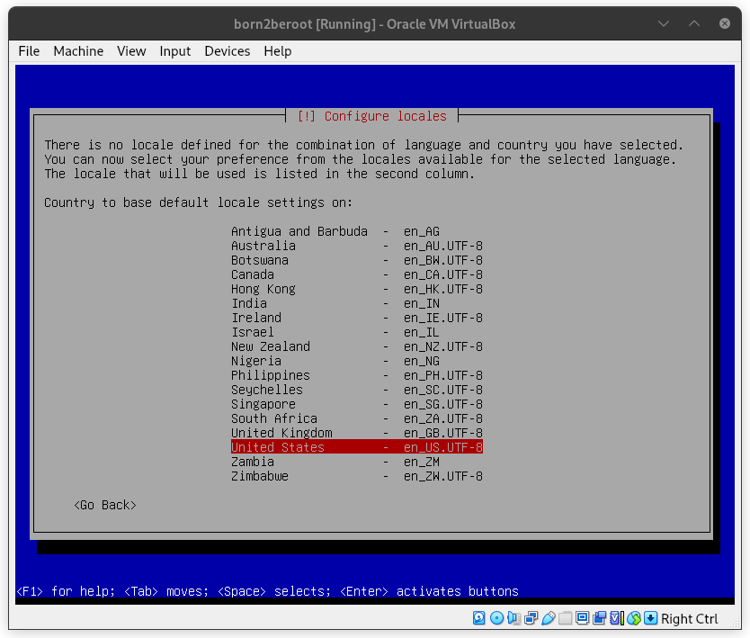
</br>

> ### 3.2.6
> Selecione o layout correto do teclado.
> </br>If you're unsure about your layout, check [Keyboard Layouts](https://keyshorts.com/blogs/blog/44712961-how-to-identify-laptop-keyboard-localization).
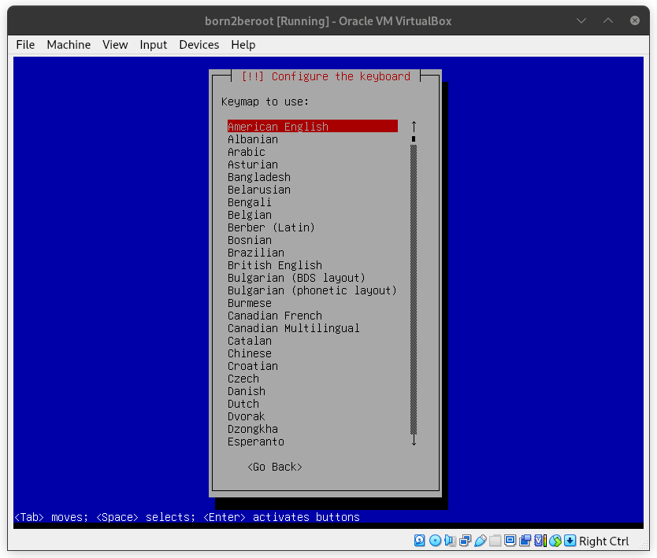
</br>

> ### 3.3: Configuring Hostname and User

> ### 3.3.1
> Set the machine's hostname to your login followed by 42, as per the project guidelines.
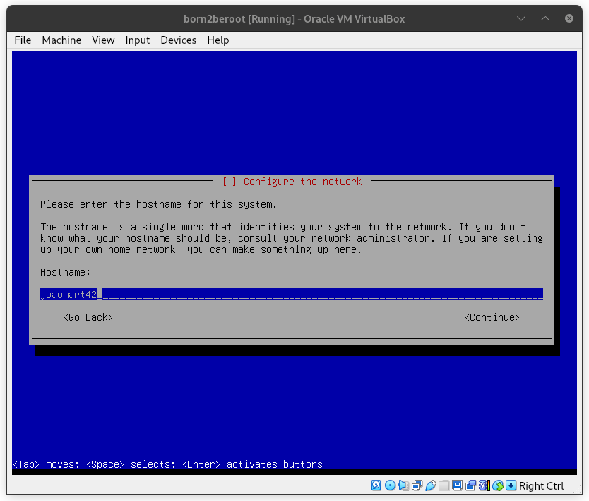
</br>

> ### 3.3.2
> Leave this field blank, as the project does not mention the need for a domain.

</br>

> ### 3.3.3
> Set a password for the root (system administrator).
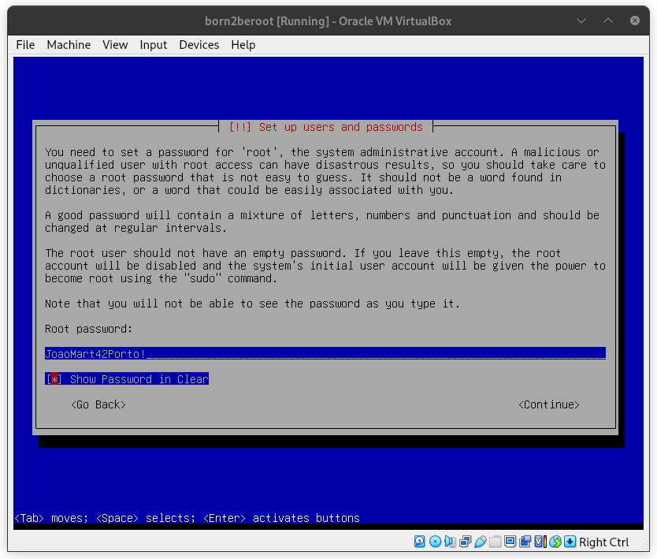
</br>

> ### 3.3.4
> Repeat the password.

</br>

> ### 3.3.5
> Create an additional user with your login for "daily" (non-root) use.

</br>

> ### 3.3.6
> Enter the password for the new user.
> </br>I recommend using the same password for simplicity.

</br>

> ### 3.3.7
> Repeat the password.

</br>

> ### 3.4: Time Zone Configuration

> ### 3.4.1
> Choose the region corresponding to your country.

</br>

> ### 3.4.2
> Select “Guided - use entire disk and set up encrypted LVM” to configure partitions with encrypted LVM.

</br>

> ### 3.4.3
> Choose the disk you want to partition (usually the only one available).

</br>

> ### 3.4.4
> Choose `Separate /home partition`.
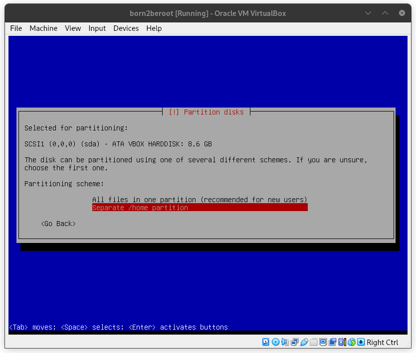
</br>

> ### 3.4.5
> Select `Yes` to confirm saving the changes.
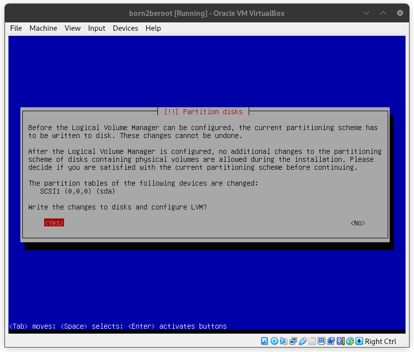
</br>

> ### 3.4.6
> Click `Cancel` to avoid deleting data on the disk.

</br>

> ### 3.4.7
> Set a password for disk encryption and save it for future use.
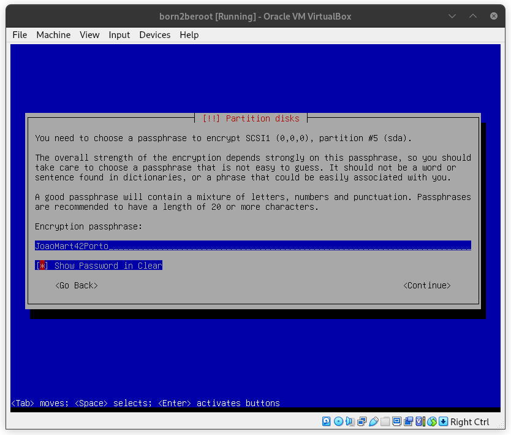
</br>

> ### 3.4.8
> Repeat the encryption password.
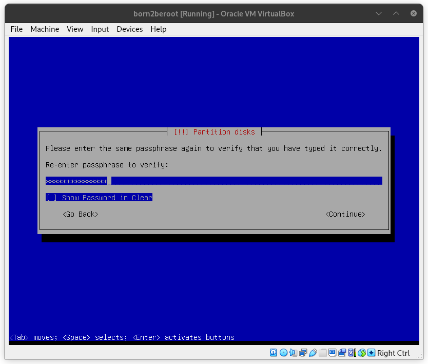
</br>

> ### 3.4.9
> Enter `max` or the maximum value shown to allocate all space.
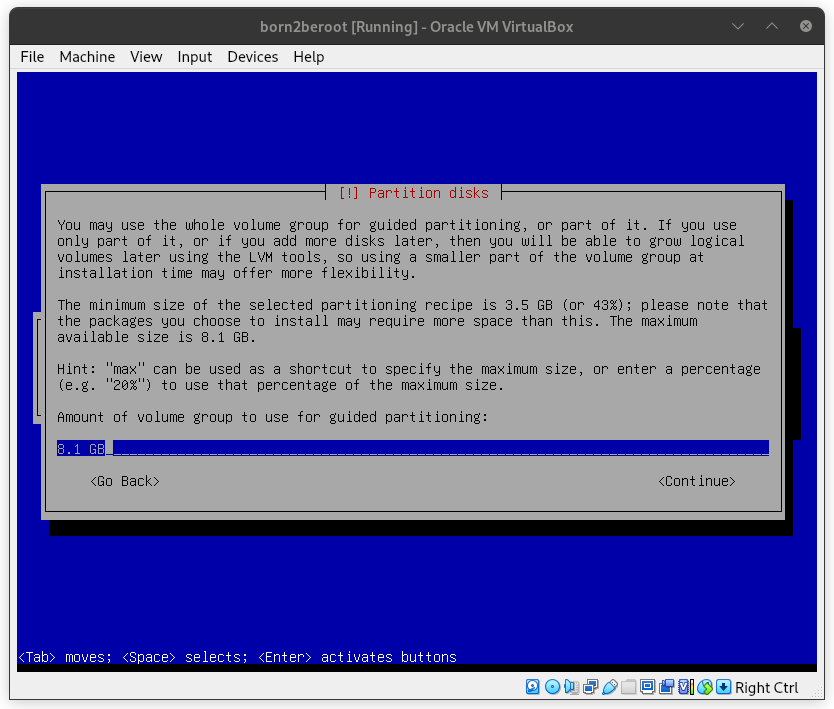
</br>

> ### 3.5: Partitioning Finalization

> ### 3.5.1
> Select `Finish partitioning and write changes to disk`.
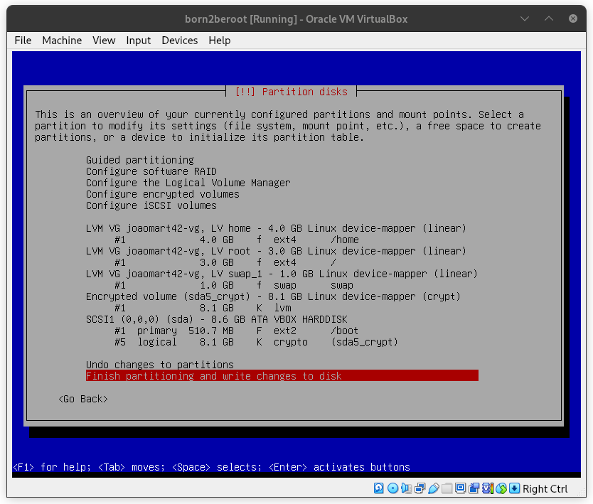
</br>

> ### 3.5.2
> Choose `Yes` to continue and confirm you do not want to make further disk changes.

</br>

> ### 3.6: Package Configuration

> ### 3.6.1
> Choose the `No` option as additional packages are not required.

</br>

> ### 3.6.2
> Select your country.

</br>

> ### 3.6.3
> Select the mirror `deb.debian.org`.

</br>

> ### 3.6.4
> Skip the proxy configuration by leaving it blank and clicking `Continue`.
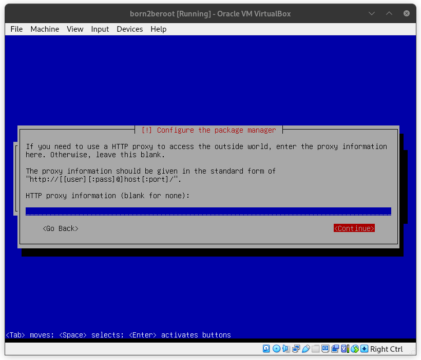
</br>

> ### 3.6.5
> Choose the `No` option.

</br>

> ### 3.7: Installing GRUB Bootloader

> ### 3.7.1
> Deselect all package options using the spacebar and click `Continue`.

</br>

> ### 3.7.2
> Choose `Yes` to install GRUB on the hard disk.
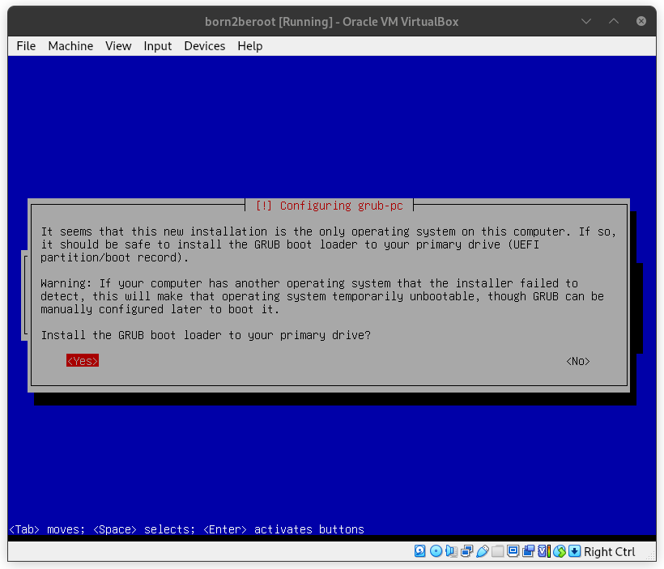

> ### 3.7.3
> Select the `/dev/sda` device to install the bootloader.


### 3.8: Finalização
> After installing GRUB, select `Continue`e to complete the process.

</br>

## 4. System Configuration

### 4.1: Log In and Prepare the Environment
- Log in with the username and password you created.
- Switch to root:
  ```bash
  su

</br>

- Install `sudo` and reboot the system:
  ```bash
  apt install sudo
  sudo reboot

</br>

- Check the `sudo` version:
  ```bash
  sudo -V

</br>

### 4.2: User and Group Configuration
- Create a new user:
  ```bash
  sudo adduser <username>

</br>

- Create the `user42` group:
  ```bash
  sudo groupadd user42

</br>

- Add the user to the `user42` and `sudo` groups:
  ```bash
  sudo adduser <username> user42
  sudo adduser <username> sudo

</br>

- Verify the groups:
  ```bash
  getent group

</br>

### 4.3: Installing Vim
- Install Vim:
  ```bash
  sudo apt install vim

</br>

> [!Warning]
> For editing files, I recommend using `Vim`.

</br>

### 4.4: SSH Configuration
- Update the packages:
  ```bash
  sudo apt update

</br>

- Install OpenSSH:
  ```bash
  sudo apt install openssh-server

</br>

- Configure SSH:
  - Edit `/etc/ssh/sshd_config`:
    ```bash
    Port 4242
    PermitRootLogin no

</br>

  - Edit `/etc/ssh/ssh_config`:
    ```bash
    Port 4242

</br>

  - Restart the SSH service:
    ```bash
    sudo service ssh restart

</br>

- Configure the firewall to allow connections on port 4242:
  ```bash
  sudo ufw enable
  sudo ufw allow 4242
  sudo ufw status

</br>

### 4.5: Sudo Policy Configuration
- Create the configuration file:
  ```bash
  sudo touch /etc/sudoers.d/sudo_config

</br>

- Add security configurations:
  ```bash
  Defaults passwd_tries=3
  Defaults badpass_message="Wrong password, try again:"
  Defaults logfile="/var/log/sudo/sudo_config"
  Defaults log_input, log_output
  Defaults iolog_dir="/var/log/sudo"
  Defaults requiretty
  Defaults secure_path="/usr/local/sbin:/usr/local/bin:/usr/sbin:/usr/bin:/sbin:/bin:/snap/bin"

</br>

- Crie o diretório de logs:
  ```bash
  mkdir /var/log/sudo

</br>

### 4.6: Password Policy Configuration
- Edit `/etc/login.defs` file:
  ```bash
  PASS_MAX_DAYS 30
  PASS_MIN_DAYS 2
  PASS_WARN_AGE 7

</br>

- Update the policies for existing users:
  ```bash
  sudo chage -m 2 -M 30 <username>

</br>

- Add the following options:
  ```bash
  minlen=10 ucredit=-1 dcredit=-1 lcredit=-1 maxrepeat=3 reject_username difok=7 enforce_for_root

</br>

### 4.7: Crontab and Script Configuration
- Configure Crontab to run every 10 minutes:
  ```bash
  sudo crontab -u root -e

</br>

- Add:
  ```bash
  */10 * * * * sh /usr/local/bin/sleep.sh; sh /usr/local/bin/monitoring.sh

</br>

- Create and configure the scripts:
  - `sleep.sh`:
    ```bash
    touch /usr/local/bin/sleep.sh
    vim /usr/local/bin/sleep.sh

</br>

  - Code:
    ```bash
    #!/bin/bash
    sleep $(who -b | awk '{ split($4, time, ":"); print time[2]%10 }')m

</br>

  - `monitoring.sh`:
    ```bash
    touch /usr/local/bin/monitoring.sh
    vim /usr/local/bin/monitoring.sh

</br>

  - Code:
    ```bash
    #!/bin/bash

    # ARCH
    arch=$(uname -a)
    
    # CPU PHYSICAL
    cpuf=$(grep "physical id" /proc/cpuinfo | wc -l)
    
    # CPU VIRTUAL
    cpuv=$(grep "processor" /proc/cpuinfo | wc -l)
    
    # RAM
    ram_total=$(free --mega | awk '$1 == "Mem:" {print $2}')
    ram_use=$(free --mega | awk '$1 == "Mem:" {print $3}')
    ram_percent=$(free --mega | awk '$1 == "Mem:" {printf("%.2f"), $3/$2*100}')
    
    # DISK
    disk_total=$(df -m | grep "/dev/" | grep -v "/boot" | awk '{disk_t += $2} END {printf ("%.1fGb\n"), disk_t/1024}')
    disk_use=$(df -m | grep "/dev/" | grep -v "/boot" | awk '{disk_u += $3} END {print disk_u}')
    disk_percent=$(df -m | grep "/dev/" | grep -v "/boot" | awk '{disk_u += $3} {disk_t+= $2} END {printf("%d"), disk_u/disk_t*100}')
    
    # CPU LOAD
    cpul=$(vmstat 1 2 | tail -1 | awk '{printf $15}')
    cpu_op=$(expr 100 - $cpul)
    cpu_fin=$(printf "%.1f" $cpu_op)
    
    # LAST BOOT
    lb=$(who -b | awk '$1 == "system" {print $3 " " $4}')
    
    # LVM USE
    lvmu=$(if [ $(lsblk | grep "lvm" | wc -l) -gt 0 ]; then echo yes; else echo no; fi)
    
    # TCP CONNECTIONS
    tcpc=$(ss -ta | grep ESTAB | wc -l)
    
    # USER LOG
    ulog=$(users | wc -w)
    
    # NETWORK
    ip=$(hostname -I)
    mac=$(ip link | grep "link/ether" | awk '{print $2}')
    
    # SUDO
    cmnd=$(journalctl _COMM=sudo | grep COMMAND | wc -l)
    
    wall "	Architecture: $arch
        CPU physical: $cpuf
        vCPU: $cpuv
        Memory Usage: $ram_use/${ram_total}MB ($ram_percent%)
        Disk Usage: $disk_use/${disk_total} ($disk_percent%)
        CPU load: $cpu_fin%
        Last boot: $lb
        LVM use: $lvmu
        Connections TCP: $tcpc ESTABLISHED
        User log: $ulog
        Network: IP $ip ($mac)
        Sudo: $cmnd cmd"

</br>

### 4.8: Test the SSH Connection
- Change the Virtual Machine settings to Bridge adapter:
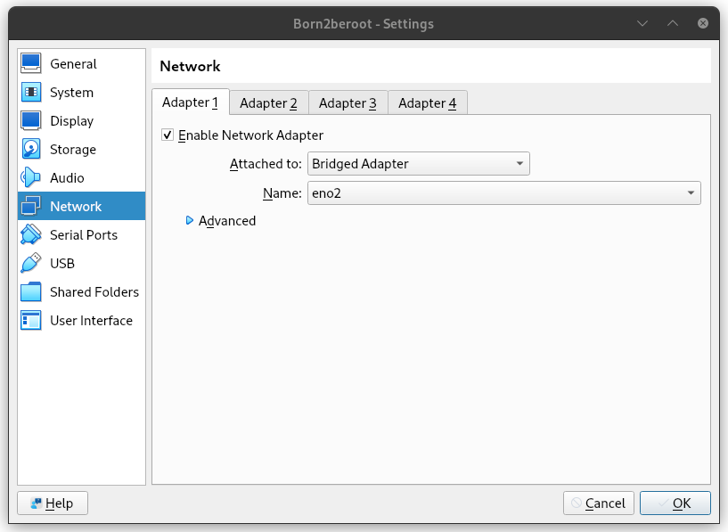

- Get the IP of the Virtual Machine:
  ```bash
  hostname -I

</br>

- Outside the Virtual Machine, connect via SSH:
  ```bash
  ssh <username>@<IP_Virtual_Machine> -p 4242

</br>

### 4.9: Reboot the Virtual Machine
- Reboot the system:
  ```bash
  sudo reboot

</br>

> [!Warning]
> Now confirm that the message appears every 10 minutes.

</br>

## 5. Obtain the Signature

> Turn off the VM.
> </br>Locate the path where the VM is stored.
> </br>Run the following command to obtain the signature:
>   ```bash
>   sha1sum <vm-name.vdi>

</br>

> After obtaining the key, create the `signature.txt` file:
>   ```bash
>   echo <signature_key> > signature.txt

Copy the signature.txt to your internal repository.
</br>
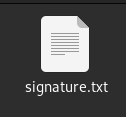

</br>

> [!Warning]
> **Clone** the VM or take a **Snapshot** to avoid changing the obtained signature. 
> </br>For testing or training, always use the **cloned** VM or the **snapshot**.

---
